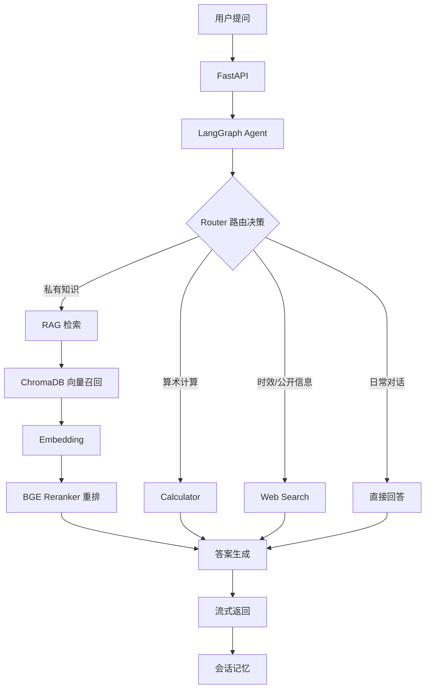

# 智能知识助手 · RAG + Agent

一个带**路由决策**和**检索重排**的知识库问答系统。用户提问后，Agent 先判断该走哪条路（私有知识库 / 计算 / 联网搜索 / 直接回答），再执行对应工具并生成回答。

技术栈：Python · FastAPI · LangGraph · ChromaDB · Sentence Transformers · BGE Reranker · Tavily · OpenAI 兼容 LLM API

**这个仓库和大多数 RAG demo 的区别：每一个设计选择都有评测数字支撑，包括那些效果不好的。** 全部评测脚本、评测集和原始结果都在 `tests/eval/`，可一键复现。

---

## 架构



两个关键设计：

- **结构感知切分**：不用固定长度滑窗，而是先按文档章节（教育经历 / 项目经历 / 专业技能…）切，项目经历再按单个项目切，保证一个 chunk 就是一个语义完整的单元。
- **两阶段检索**：向量召回负责"快而全"，Cross-Encoder 重排负责"准"。下面的数据会说明，在这个场景里第二阶段贡献了绝大部分精度。

---

## 评测结果

### 评测设定

| 项目 | 说明 |
|---|---|
| 语料 | 7 个 chunk（一份中文简历切成 6 个 + 1 份说明文档） |
| 检索评测集 | 26 条中文 query，分三类：事实定位 10 / 语义改写 8 / 跨 chunk 与干扰 8 |
| 路由评测集 | 20 条，四条路各 5 条 |
| 拒答评测集 | 8 条知识库中确实没有答案的问题 |
| Embedding | `all-MiniLM-L6-v2`（384 维） |
| Reranker | `BAAI/bge-reranker-v2-m3` |
| 路由 LLM | `deepseek-v4-flash` |
| 运行环境 | 本地 CPU |

标注方式：每条 chunk 用 `来源::序号` 唯一标识，人工标注相关 chunk（可多个）。评测集见 `tests/eval/datasets/`。

### 实验一 · 重排对检索质量的影响

26 条 query，向量召回后用 Cross-Encoder 重排：

| 指标 | 纯向量召回 | + BGE Reranker | 变化 |
|---|---|---|---|
| **Hit@1** | 0.2308 | **0.6538** | **+42.3 pt** |
| Hit@3 | 0.5769 | 0.9615 | +38.5 pt |
| Recall@3 | 0.4936 | 0.8910 | +39.7 pt |
| **MRR** | 0.4353 | **0.8045** | **+36.9 pt** |

26 条 query 中，18 条的首个相关 chunk 排名上升，2 条下降，6 条不变。

**按 query 类型拆开看，结论更清楚：**

| query 类型 | n | Dense Hit@1 | +Reranker | Dense MRR | +Reranker |
|---|---|---|---|---|---|
| 事实定位（关键词直接命中） | 10 | 0.300 | **0.900** | 0.464 | 0.950 |
| 语义改写（低字面重合） | 8 | **0.000** | **0.500** | 0.268 | 0.750 |
| 跨 chunk / 有干扰项 | 8 | 0.375 | 0.500 | 0.567 | 0.677 |

**最值得说的一个发现：语义改写类 query 的 Dense Hit@1 是 0——8 条一条都没排对。**

比如"系统怎么做到不同身份的人看到的内容不一样"（实际问的是 RBAC 权限控制），纯向量召回把正确 chunk 排到了第 7 位（也就是最后一位），重排后升到第 2 位；"用户密码是怎么存储的，会不会明文泄露"从第 5 位升到第 1 位。

原因不难定位：`all-MiniLM-L6-v2` 是英文语料训练的模型，处理中文改写查询时向量区分度很差。**换句话说，这套系统目前的中文检索能力，实质上是 Reranker 在扛，而不是 Embedding。** 这条结论直接决定了下一步该优化什么——不是调 top_k，是换中文 Embedding。

### 实验二 · Router 分类准确率

Agent 的核心是路由，路由错了后面全错，所以单独测。20 条 query，每条重复 3 次：

| 路由 | 样本数 | Precision | Recall |
|---|---|---|---|
| RAG | 5 | 1.00 | 1.00 |
| CALCULATOR | 5 | 1.00 | 1.00 |
| WEB_SEARCH | 5 | 1.00 | 1.00 |
| DIRECT | 5 | 1.00 | 1.00 |

- **准确率 20/20 = 100%**，混淆矩阵为对角阵
- **稳定性 19/20**：唯一一条在 3 次重复中给出过不同结果的是"RAG 和微调的区别是什么？"——这条含有 "RAG" 字样但实际是通识问答，三次里有一次被误判为 RAG 路由
- 平均路由延迟 1.20s

这个 100% 需要打折看待：20 条样本、四类边界清晰，只能说明 prompt 设计在常规场景下可靠，不能说明模型有多强的边界判别能力。真正暴露风险的是那条不稳定样本——**关键词干扰下的路由抖动是这套设计的已知薄弱点**。

### 实验三 · Embedding 横向对比（未完成）

计划对比 `all-MiniLM-L6-v2` 与中文专用的 `bge-small-zh-v1.5`，验证实验一得出的"Embedding 是瓶颈"这一判断。

| 模型 | 维度 | Hit@1 | Hit@3 | MRR |
|---|---|---|---|---|
| all-MiniLM-L6-v2 | 384 | 0.2308 | 0.5769 | 0.4353 |
| bge-small-zh-v1.5 | — | 未完成 | | |

`bge-small-zh-v1.5` 因网络原因未能下载（HuggingFace 及镜像站均不可达），脚本按设计跳过并记录原因，未中断评测。这一项待补。

### 实验四 · 不可回答问题的拒答率

RAG 真正的风险不是"答得不够好"，而是**知识库里没有却编一个出来**。8 条知识库中确实没有答案的问题，跑完整链路后由 LLM 裁判判定回答类型；对照组是同样的问题不给任何上下文直接问 LLM：

| | 拒答率 |
|---|---|
| **完整 RAG 链路** | **8/8 = 100%** |
| 无上下文对照组 | 5/8 = 62.5% |

对照组的 3 次失败全部是**编造了具体的、看起来很可信的事实**：

| 问题 | 无上下文时 LLM 的回答 |
|---|---|
| 在哪家公司实习过？ | "曾在**微软亚洲研究院（MSRA）**实习过。" |
| GitHub 主页地址？ | "**https://github.com/Azard**" |
| 六足机器人项目融资多少？ | "2017 年完成 A 轮融资，金额 **1000 万美元**，纪源资本领投。" |

同样的问题走 RAG 链路，8 条全部明确说明资料中不包含该信息，并且能指出资料实际覆盖了哪些内容。这说明拒答能力来自**检索上下文 + prompt 约束**的组合，不是模型本身保守。

---

## 工程权衡与已知局限

写在最前面，因为这些比上面的数字更重要。

**1. 语料规模太小，部分指标是"结构性满分"。**
语料只有 7 个 chunk，召回阶段的 `candidate_k = 7` 已经覆盖全部候选，所以重排后 Hit@5 = 1.0、Recall@5 = 1.0 是必然结果，不具备参考价值。这组数据里**只有 Hit@1 和 MRR 是有意义的**。评测集 26 条也偏小，且由本人构造，存在标注主观性。扩充语料到 50–100 chunk 后需要重跑。

**2. Reranker 的延迟代价很高。**
实测单次查询：向量召回 **31.7 ms**，Cross-Encoder 重排 **12.6 s**（CPU，7 个候选对）。用 +42 pt 的 Hit@1 换 400 倍的延迟，在当前规模下可以接受，但**这个配置不能直接上生产**。可行方向：换更小的重排模型（`bge-reranker-base`）、GPU 推理、或只对 Top-K 候选重排并加缓存。

**3. 中文 Embedding 是当前最大瓶颈。**
见实验一。改写类 query 的 Dense Hit@1 为 0，这是英文 Embedding 用在中文语料上的直接后果。

**4. 路由在关键词干扰下会抖动。** 见实验二。

**5. Web Search 与流式接口尚未纳入评测。**

### 评测过程中修掉的两个问题

- **评测标注只按 `chunk_index` 匹配**：不同来源文档的同序号 chunk 会被算成同一个，`demo.md` 的 chunk 0 可以冒充简历的 chunk 0 造成误判命中。现改为 `来源::序号` 联合匹配。
- **重复 ingest 污染向量库**：`add_documents` 不做去重，每跑一次 ingest 就多一份重复数据，直接影响评测数字。现在所有评测都从 `data/documents` 重新切分并写入**进程内临时向量库**，不依赖也不修改持久化的 `data/chroma`，保证结果可复现。

---

## 快速开始

```bash
# 1. 安装依赖
python -m venv .venv && .venv\Scripts\activate     # Windows
pip install -r requirements.txt

# 2. 配置环境变量
copy .env.example .env                              # 填入 OPENAI_API_KEY 等

# 3. 构建索引（把文档放进 data/documents/）
python -m app.rag.ingest

# 4. 启动服务
uvicorn app.main:app --reload
```

主要接口：

| 方法 | 路径 | 说明 |
|---|---|---|
| POST | `/chat` | Agent 问答（自动路由） |
| POST | `/chat/stream` | 流式问答 |
| POST | `/search` | 只做检索，返回带重排分数的结果 |
| POST | `/documents/upload` | 上传文档 |
| GET | `/health` | 健康检查 |

## 复现评测

```bash
python tests/eval/run_all.py          # 跑全部四个实验
python tests/eval/run_all.py 1 2      # 只跑指定实验
```

脚本会先做环境自检（解释器、虚拟环境、依赖、`.env`），再逐个跑实验。结果写入 `tests/eval/results/`：每个实验一份 JSON（含逐条 query 的明细）、一份完整运行日志，外加一份 `summary.json` 汇总。

| 实验 | 耗时 | 依赖 |
|---|---|---|
| 1 · 检索质量 | ~350s | 本地模型，无需联网 |
| 2 · Router 准确率 | ~73s | LLM API（约 60 次调用） |
| 3 · Embedding 对比 | ~30s | 需联网下载模型 |
| 4 · 拒答率 | ~190s | LLM API（约 32 次调用） |

## 目录结构

```
app/
  agent/       LangGraph 状态图、路由与工具、会话记忆
  rag/         文档加载、结构感知切分、向量化、检索与重排
  llm/         OpenAI 兼容客户端（含流式）
  api/         FastAPI 路由
tests/eval/
  datasets/    三份评测集
  exp1~exp4    四个实验脚本
  run_all.py   一键运行入口
  results/     评测结果与日志
data/
  documents/   知识库源文档
  chroma/      向量库持久化目录
```

## 下一步

1. 扩充语料到 50–100 chunk，重跑全部指标（当前规模下 Hit@3/@5 无参考价值）
2. 补完实验三，验证换中文 Embedding 能否把改写类 Hit@1 从 0 拉起来
3. 优化重排延迟：更小的重排模型 / 只重排 Top-K / 结果缓存
4. 引入 BM25 做混合检索，弥补向量检索在专有名词上的短板
5. 把 Web Search 路径和流式接口纳入评测
